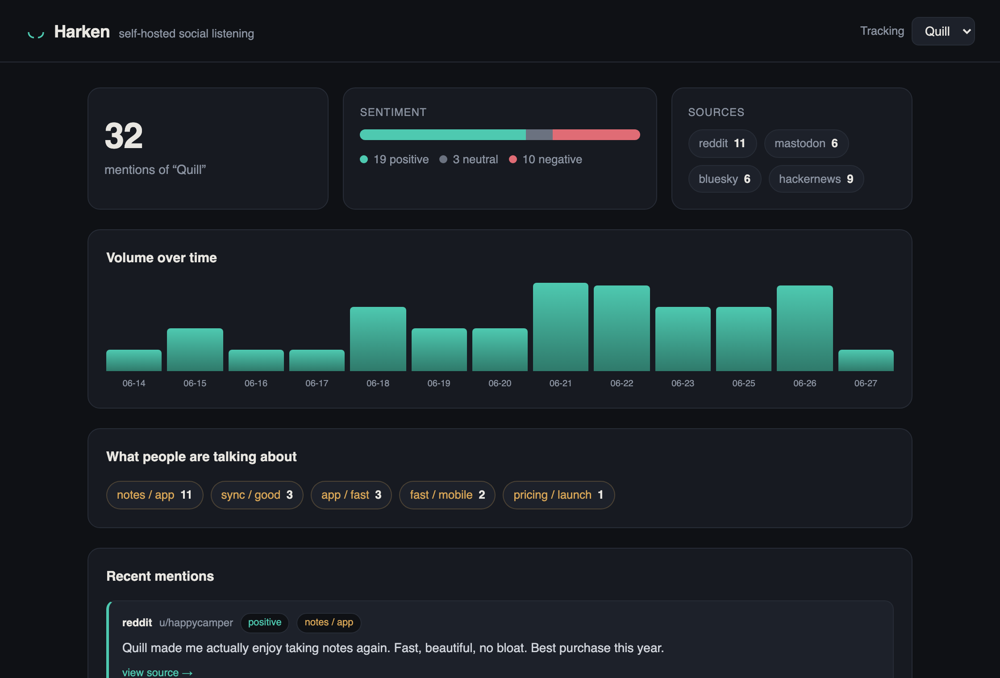
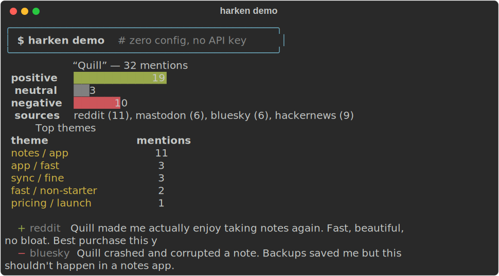
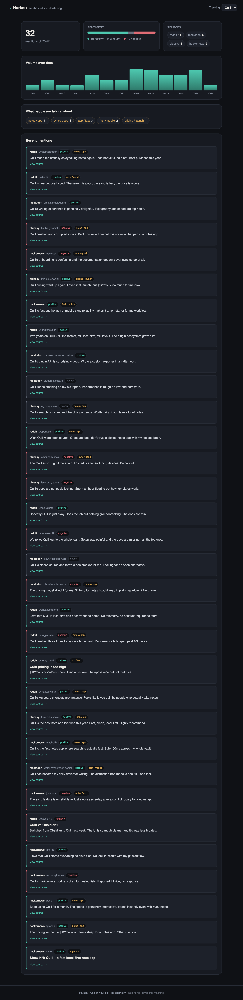

<div align="center">

# ◟◞ Harken

**Self-hosted social listening — hear what the internet says about you, on your own box.**

Track a keyword, brand, or product across Hacker News, Reddit, Mastodon, Bluesky, and RSS.
Get sentiment and themes in a clean local dashboard. No SaaS, no telemetry, no per-seat pricing — your data never leaves your machine.

[](https://github.com/VladUZH/harken/actions/workflows/ci.yml)
[](LICENSE)
[](https://www.python.org/)
[](#contributing)

</div>

<div align="center">

</div>

---

## Why Harken

Brand-monitoring tools like Brand24, Mention, and Honestly are great — and closed, cloud-only, and **$30–300/month**. They ingest everything *you* say about *your* product into *their* servers. For a lot of people — indie founders, OSS maintainers, privacy-conscious teams — that's backwards.

Harken does the core job those tools do — **"what are people saying about X, and is it good or bad?"** — as a small open-source program you run yourself:

- **🏠 Self-hosted & local-first.** One SQLite file on your machine. Nothing phones home. No account required.
- **🔓 Open source (MIT).** Read it, fork it, extend it. No lock-in.
- **🆓 Free, and zero-config.** `harken demo` works on a clean clone with **no API key and no signup**.
- **🧩 LLM-agnostic.** Sentiment and themes work with **no model at all** (transparent local analysis). Want richer theme labels? Plug in Anthropic, OpenAI, *or a fully-local Ollama* — your choice, swappable in one env var.
- **🌐 Free sources first.** Hacker News, Reddit, Mastodon, Bluesky, and any RSS feed — no paid data deals required.

## The problem

You shipped something. People are talking about it — on HN, in a subreddit, on Mastodon, on Bluesky. Some of it is praise, some of it is a bug report you'd really like to see, some of it is "is there an open alternative?". Manually checking five sites every day doesn't scale, and the SaaS tools that automate it want a monthly subscription and a copy of all your data.

Harken is the small, honest, self-hosted version: point it at a keyword, and it aggregates the mentions, scores their sentiment, and clusters what people keep bringing up — locally.

## How it works

```
  sources ──▶ normalize ──▶ sentiment ──▶ themes ──▶ SQLite ──▶ dashboard / CLI
 HN, Reddit,   (one Mention   (local         (TF-based     (one file,   (web + terminal)
 Mastodon,      schema)        lexicon, or     clustering,   on your box)
 Bluesky, RSS                  optional LLM)   + optional LLM labels)
```

1. **Sources** are pluggable adapters. The two defaults (Hacker News, Reddit) need **no credentials**.
2. Each result is normalized into a common `Mention` and **de-duplicated** by content hash.
3. **Sentiment** is scored by a built-in lexicon analyzer — no key, no model download, runs instantly. An LLM is an *optional* upgrade, never a requirement.
4. **Themes** are extracted by clustering mentions on their shared salient terms ("pricing", "performance", "docs"…).
5. Everything lands in **SQLite** and renders in a local **web dashboard** and a **terminal report**.

## 30-second quickstart

Requires Python 3.10+. (Examples use [`uv`](https://github.com/astral-sh/uv); plain `pip` works too.)

```bash
git clone https://github.com/VladUZH/harken
cd harken
uv venv && uv pip install -e .

# 1. See the whole thing on bundled sample data — no key, no network:
harken demo
#    → loads a sample dataset, scores sentiment + themes,
#      and opens the dashboard at http://localhost:8042

# 2. Track something real (live, still no API key needed):
harken track "your-product"
harken serve            # open the dashboard at http://localhost:8042
```

That's it. No account, no key, no config file.

> Want richer theme names from an LLM? It's optional — copy `.env.example` to `.env` and set `HARKEN_LLM_PROVIDER` to `anthropic`, `openai`, or `ollama` (local). Everything still works without it.

## Demo

`harken demo` — the full pipeline on bundled sample data, zero config:

<div align="center">

</div>

…and the local dashboard it serves:

<div align="center">

</div>

## Harken vs. the closed tools

Only ✅ items are **built today**. 🚧 = on the [roadmap](#roadmap).

| | **Harken** | Brand24 / Mention / Honestly |
|---|:---:|:---:|
| Self-hostable, runs on your box | ✅ | ❌ |
| Open source (MIT) | ✅ | ❌ |
| No telemetry — data stays local | ✅ | ❌ |
| Free | ✅ | ❌ ($30–300/mo) |
| Zero-config / no-key first run | ✅ | ❌ |
| LLM-agnostic (Anthropic / OpenAI / local Ollama / none) | ✅ | ❌ |
| Hacker News | ✅ | partial |
| Reddit | ✅ | ✅ |
| Mastodon / Bluesky | ✅ | partial |
| RSS / custom feeds | ✅ | partial |
| Sentiment analysis | ✅ | ✅ |
| Theme / topic clustering | ✅ | ✅ |
| Web dashboard + CLI | ✅ | ✅ (web) |
| X/Twitter, TikTok, Instagram | 🚧 (BYO key) | ✅ |
| Email / Slack / webhook alerts | 🚧 | ✅ |
| Scheduled polling, historical backfill | 🚧 | ✅ |

**Honest take:** the paid tools cover locked-down platforms (X, TikTok, Instagram) and ship alerting and history that Harken doesn't have yet. Harken wins on openness, privacy, cost, and the free/open sources — and it's a weekend's worth of code you fully control.

## Sources

| Source | Zero-config | Notes |
|--------|:-----------:|-------|
| Hacker News | ✅ | Public Algolia API — no key, no limits. |
| Reddit | ✅ | Public search JSON. Rate-limited; failures are isolated, never fatal. |
| Mastodon | — | Public search on any instance (`HARKEN_MASTODON_INSTANCE`). |
| Bluesky | — | Public AT-Protocol search endpoint. |
| RSS / Atom | needs feeds | Point it at any feed — a blog, a news site, or a Google Alerts RSS. |

Adding a source is one small class implementing `fetch()` — see [`src/harken/sources/`](src/harken/sources/).

## Configuration

Everything is optional and has a sane default — see [`.env.example`](.env.example). Highlights:

| Variable | Default | What it does |
|----------|---------|--------------|
| `HARKEN_SOURCES` | `hackernews,reddit` | Which sources to query. |
| `HARKEN_DB` | `harken.db` | SQLite path. |
| `HARKEN_LLM_PROVIDER` | `none` | `none` \| `anthropic` \| `openai` \| `ollama`. |
| `HARKEN_RSS_FEEDS` | — | Comma-separated feed URLs. |

## Roadmap

Built today is everything marked ✅ above. Next up (contributions very welcome):

- [ ] **More sources** behind a bring-your-own-key flag: X/Twitter, YouTube, Lobsters, Stack Overflow.
- [ ] **Alerting** — email / Slack / webhook when sentiment dips or volume spikes.
- [ ] **Scheduled polling** (cron / daemon) so tracking runs itself.
- [ ] **LLM sentiment** as an opt-in upgrade over the lexicon baseline.
- [ ] **Historical backfill** and multi-keyword "projects".
- [ ] **Docker / compose** one-liner.
- [ ] **Add/track keywords from the web UI** (today it's CLI-driven).

## Contributing

Issues and PRs are welcome — new source adapters, a better sentiment lexicon, and roadmap items especially. Run the suite with:

```bash
uv pip install -e ".[dev]"
pytest -q && ruff check src tests
```

## License

MIT © Harken contributors. See [LICENSE](LICENSE).
